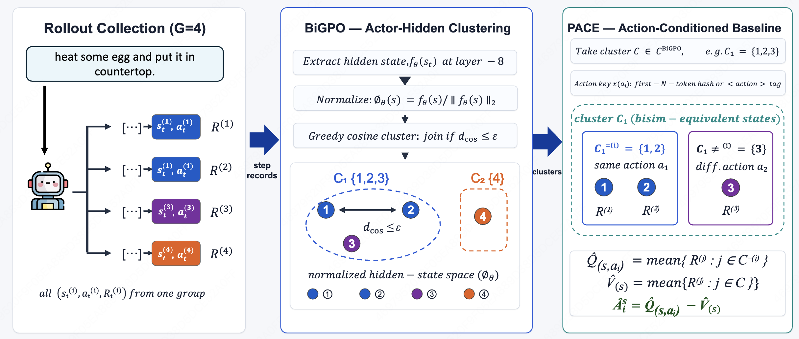

# BiPACE: Bisimulation-Guided Policy Optimization with Action Counterfactual Estimation for LLM Agents

<p align="center">
  <a href="https://arxiv.org/abs/YOUR_ARXIV_ID">
    
  </a>
  
  
</p>

> **Hanyang Wang**¹†, **Weijieying Ren**³, **Yuxiang Zhang**², **Ding Cao**⁴, **Tianxiang Zhao**²*
>
> ¹University of Chicago · ²The Hong Kong University of Science and Technology (Guangzhou) · ³Stanford University · ⁴University of Science and Technology of China
>
> †First author · *Corresponding author

---

## 🚀 Code Coming Soon

We are finalizing the code release. The full implementation will be made publicly available shortly after conference submission. Stay tuned!

---

## Overview

**BiPACE** is a drop-in advantage estimator for stepwise group-based RL training of LLM agents (e.g., GRPO / GiGPO). It addresses a fundamental but overlooked issue in existing methods: the **state-action credit mismatch**.

### The Problem: State-Action Credit Mismatch

Stepwise group-based RL methods (such as [GiGPO](https://arxiv.org/abs/2505.XXXXX)) compute step-level advantages by grouping rollout steps that share the same observation. This design has two coupled failure modes:

| Side | Problem | Consequence |
|------|---------|-------------|
| **State** | Exact observation hashing is too fine-grained — semantically equivalent states hash differently | Singleton groups with zero step-level gradient signal |
| **Action** | A single within-group mean is too coarse — all actions from the same state get the same baseline | Mixes state-value estimation with action-specific credit |

In our GiGPO reproduction on ALFWorld, **34.2%** of clusters are singletons at iteration 10, rising to **27.3%** on average across training — meaning over a quarter of step-level gradients are simply discarded.

### The Solution: BiPACE = BiGPO + PACE

BiPACE makes two local replacements to the GiGPO step-level estimator, requiring **no critic, no auxiliary loss, and no extra rollouts**:

<p align="center">
  
</p>

**BiGPO (Bisimulation-Guided Policy Optimization)**
- Replaces observation hashing with cosine clustering on the actor's own hidden states at a fixed late layer
- Uses the policy's internal geometry as an empirical proxy for bisimulation distance
- Substantially reduces singleton groups while introducing only *O(ε)* bias under a MICo-Lipschitz assumption

**PACE (Policy Action Counterfactual Estimation)**
- Within each behavioral cluster, partitions steps by executed action key
- Computes a nonparametric local estimate of *Q̂(s,a) − V̂(s)*:
  - *V̂(s)*: mean return over all cluster members
  - *Q̂(s,a)*: mean return over same-action peers
- The Q-style form yields a cleaner counterfactual advantage than a simple within-group mean

The final per-token advantage is:

$$A^{\text{BiPACE}}(i) = A^{\text{ep}}(i) + w \cdot \hat{A}^{S}(i)$$

where the PPO surrogate objective and all other training components remain **unchanged**.

---

## Results

### ALFWorld & WebShop

BiPACE_Q significantly outperforms GRPO, GiGPO, and HiGPO at both 1.5B and 7B scales:

| Method | ALFWorld 1.5B | ALFWorld 7B | WebShop 7B (Score) |
|--------|:---:|:---:|:---:|
| GRPO | 75.2±3.8 | 77.6±5.2 | 79.3±2.8 |
| GiGPO | 86.7±1.7 | 90.8±1.3 | 86.2±2.6 |
| HiGPO | 92.8±1.1 | 95.4±0.6 | 89.0±1.0 |
| **BiPACE_Q (ours)** | **93.5±1.2** | **97.1±0.9** | **89.6±1.3** |

- **+6.3pp** over GiGPO on ALFWorld/7B; crosses **95% on every seed**
- **+6.8pp** over GiGPO on ALFWorld/1.5B
- Only **11.3% step overhead** (the hidden-state forward pass); PACE grouping itself costs 0.14% of a step

### TextCraft (Out-of-Domain Transfer)

| Method | Overall 1.5B | Overall 7B |
|--------|:---:|:---:|
| GiGPO | 58.3±7.8 | 87.0±2.4 |
| HiGPO | 59.4±8.0 | 87.5±2.3 |
| **BiPACE_Q (ours)** | **65.1±7.0** | **91.1±2.4** |

### Sample Efficiency

BiPACE_Q reaches every success threshold first across all benchmarks:
- **1.18–1.33×** faster on ALFWorld/1.5B across the 50–80% band
- **1.05–1.25×** faster on ALFWorld/7B; only method to cross 95% within the 150-step budget
- Up to **2.00×** speedup on TextCraft/1.5B

---

## Method Details

### Greedy Cosine Clustering (BiGPO)

For each prompt group, BiGPO runs a single-pass greedy algorithm:
1. Extract the actor's hidden state at a fixed late layer (layer −8 for 7B, −12 for 1.5B)
2. ℓ₂-normalize to obtain φ_θ(s)
3. Greedily assign each step record to the nearest existing cluster centroid if cosine distance ≤ ε; otherwise seed a new cluster

GiGPO is recovered as the special case ε = 0 with a one-hot identity embedder.

### PACE Estimator Variants

| Variant | Estimator | Key |
|---------|-----------|-----|
| first-token | diff-peer mean | first 8 response tokens |
| action-tag | diff-peer mean | `<action>...</action>` body |
| **Q-style** (default) | *Q̂(s,a) − V̂(s)* | action-tag |

Q-style is the strongest variant across all tested settings.

### Hyperparameters

| Setting | ALFWorld 7B | ALFWorld 1.5B |
|---------|-------------|---------------|
| Layer | −8 | −12 |
| ε | 0.10 | 0.05 |
| PACE key | action\_tag | action\_tag |
| Estimator | q\_style | q\_style |
| Group size G | 8 | 8 |
| Horizon | 50 | 50 |

---

## Theoretical Guarantees

- **Bias bound**: Under a MICo-Lipschitz assumption, BiGPO's step-baseline bias is bounded by *2Lε*
- **GiGPO as special case**: Setting ε = 0 recovers GiGPO exactly; singleton clusters produce zero step-level gradient deterministically
- **Q-style unbiasedness**: Under exact bisimulation (ε = 0), the Q-style PACE estimator is unbiased for *A^π(s,a)*

---

## Environments

| Environment | Description |
|-------------|-------------|
| [ALFWorld](https://github.com/alfworld/alfworld) | Household task completion (6 task families) |
| [WebShop](https://github.com/princeton-nlp/WebShop) | Online shopping navigation |
| [TextCraft](https://github.com/microsoft/TextCraft) | Minecraft-style crafting (depth-2 and depth-3 goals) |

**Models**: Qwen2.5-{1.5B, 7B}-Instruct  
**Hardware**: 2–4 × H100

---

## Citation

If you find this work useful, please cite:

```bibtex
@article{wang2025bipace,
  title={{BiPACE}: Bisimulation-Guided Policy Optimization with Action Counterfactual Estimation for {LLM} Agents},
  author={Wang, Hanyang and Ren, Weijieying and Zhang, Yuxiang and Cao, Ding and Zhao, Tianxiang},
  journal={arXiv preprint},
  year={2025}
}
```

---

## License

This project is licensed under the MIT License. See [LICENSE](LICENSE) for details.
